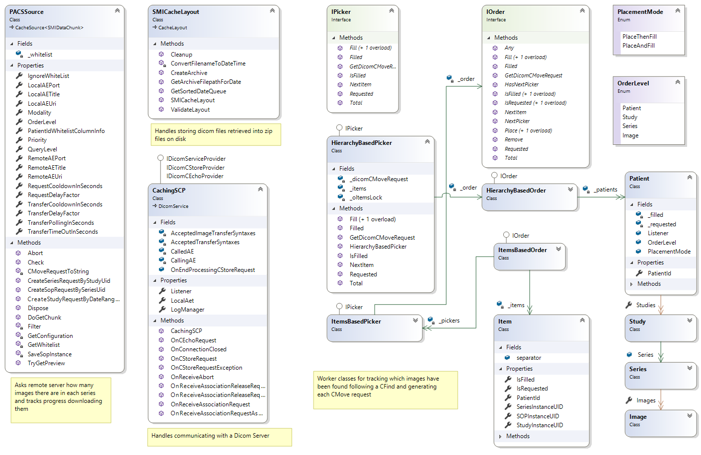

# Caching
## Background
Caching in RDMP is an optional pre process to data loading in which files are fetched over time and stored.  These files are then typically loaded by an associated DLE configuration.

## Implementation
Rdmp.Dicom includes a caching component which makes requests to a Dicom Server (typically a PACS) called `PACSSource`.  It will issue a CFind to locate relevant images for the date range being cached and then issue CMove requests to pull the images.  The following components exist in caching:

_PACSSource caching_