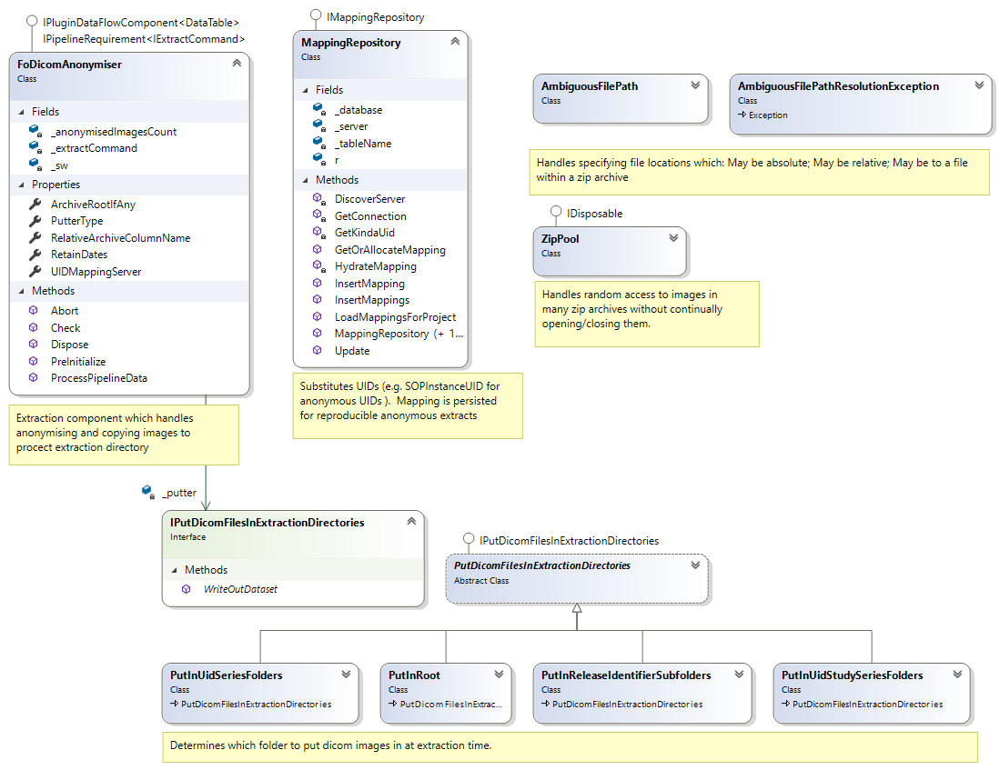

# Data Extraction
## Background
Data Extraction is the process of linking a relational dataset with a Project cohort and generating an anonymous data release.  This may include several datasets (e.g. biochemistry, prescribing etc) which might be filtered (e.g. only extract prescriptions for painkillers).

## Implementation
Image tables are treated exactly like regular datasets by RDMP.  You can build a cohort from the tables (based on PatientID), link with other datasets and produce final cohort lists.

You can extract images as part of a Project by including the imaging table in the list of datasets extracted for the Project.  Since the imaging table is just a normal table from RDMP's point of view this will result in a CSV file being produced with anonymised tag data.

If you want the images to also be fetched and anonymised then you should add the `FoDicomAnonymiser` component to your extraction pipeline (it is recommended to first clone your normal extraction pipeline).

## FoDicomAnonymiser
The FoDicomAnonymiser looks at the `System.Data.DataTable` passing through the extraction pipeline.  When it spots a dataset containing imaging file paths it copies them to the output directory after stripping identifiable tags and substituting UIDs / PatientIDs for suitable anonymous mappings.

Mappings are persisted so that repeated extractions of the same images for the same Project result in the same images being produced.

_Extraction Component FoDicomBasedExtraction_