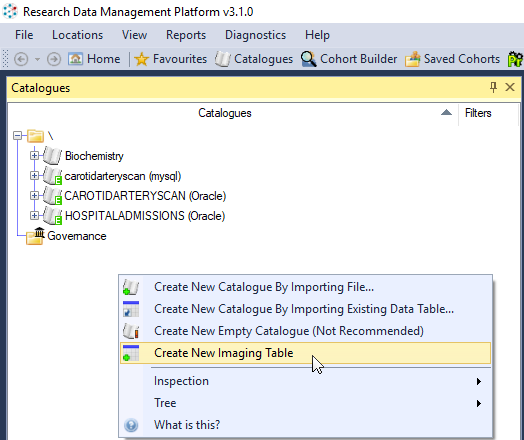
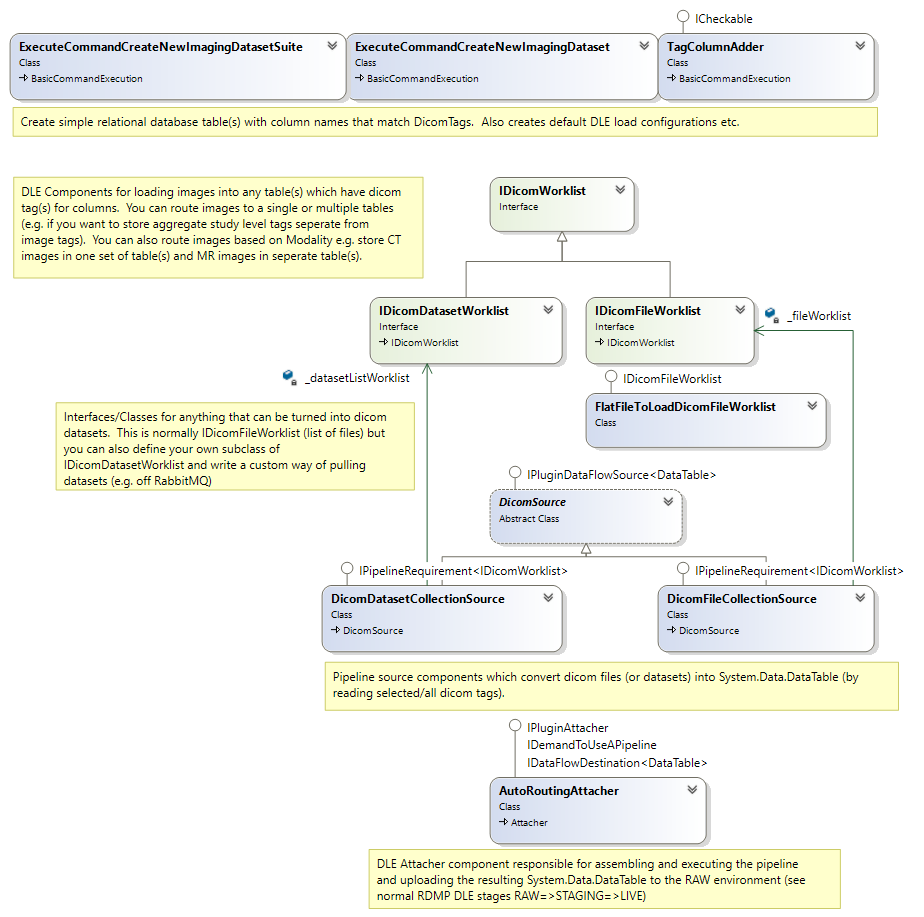

# Data Load

1. [Background](#background)
3. [Image Tables](#image-tables)
1. [Implementation](#implementation)
1. [Study Series Image Level](#study-series-image-level)

## Background
The Rdmp.Dicom plugin allows you to create and load Dicom [Image Tables].  These tables contain the location (on disk) of the image and relevant metadata (e.g. dicom tags) about each image.

Data loading in RDMP involves loading a RAW environment (empty copy of the live database schema) with data before migrating the records to STAGING and then MERGING new/changed records into LIVE.  In RDMP the components responsible for data load are called `Attachers`.  Each `Attacher` reads populates RAW in it's own way (e.g. reading a CSV file, Excel file, records from a remote database etc).

The Rdmp.Dicom plugin includes an `Attacher` which reads dicom images and populates [Image Tables].

## Image Tables

'Image tables' are any relational database table which contains one or more columns named after Dicom tags (e.g. PatientID).  At least one table should include the file path (relative or absolute) to the dicom image, it is recommended that this column should be called the constant defined in `DicomTypeTranslation.TableCreation.ImagingTableCreation.RelativeFileArchiveURI`.

You can create image tables (and an accompanying data load configuration) with the Rdmp.Dicom plugin:

You can find some [sample templates](https://github.com/SMI/DicomTypeTranslation/tree/main/Templates) in the DicomTypeTranslation repository].

All tables should have a unique primary key e.g. SOPInstanceUID.  Identical duplication is automatically handled when migrating from RAW to STAGING (prior to MERGE with LIVE) so you can use high level fields as primary keys (e.g. StudyInstanceUID) provided all values in all images are the same for that value (e.g. PatientID, PatientBirthDate etc - these are unlikely to change during a study!).

You can add new tags later on (after creating the tables) using the tag promotion command.  To add a tag at runtime to an already existing dataset just right click the Catalogue in the RDMP user interface and select 'Promote New Tag'

## Implementation

You can create/edit an imaging table using the schema commands e.g.  `ExecuteCommandCreateNewImagingDataset`

The `AutoRoutingAttacher` class is responsible for turning dicom datasets into `System.Data.DataTable` after which they are treated just like regular attached data.

_AutoRoutingAttacher Components_

## Study, Series, Image Level

Tags in dicom files are replicated in each file (frame) in a series.  Some tags vary with every image e.g. SOPInstanceUID, SliceLocation etc.  Other tags are always the same within a study e.g. PatientID.  You may want to store such tags in different tables (creating 1 study record for all images in the study).  This can be done simply by choosing the columns and primary key correctly e.g. create a table with a primary key of StudyInstanceUID and including only study level tags.  Since the RDMP DLE handles exact duplication only a single record will be created during the load (assuming all images are in the same study).

Sometimes there are differences in study/series level tags between images when you would not expect it, the following components assist with resolving this duplication during the DLE:

|Component | Description
|-------|----|
|Coalescer|  Core RDMP component which handles resolving when a tag (field) is missing in one record but present in another (for a given primary key)|
|SafePrimaryKeyCollisionResolverMutilation | Core RDMP component which handles resolving primary key collisions based on a single (non primary key) column e.g. StudyDate.  You can prefer the larger / smaller value etc |
|[PrimaryKeyCollisionIsolationMutilation](./../Rdmp.Dicom/PipelineComponents/PrimaryKeyCollisionIsolationMutilation.md) | If all the above components failed then you can use this one to isolate the colliding records into a store (and drop them from the data load) |

[Image Tables]: #image-tables
