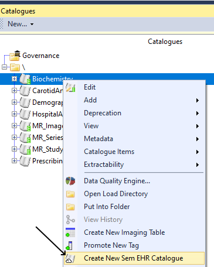
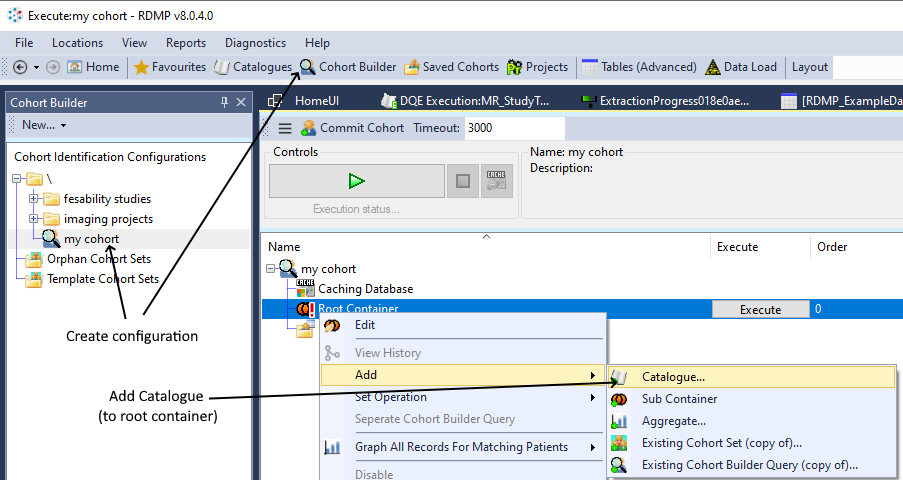
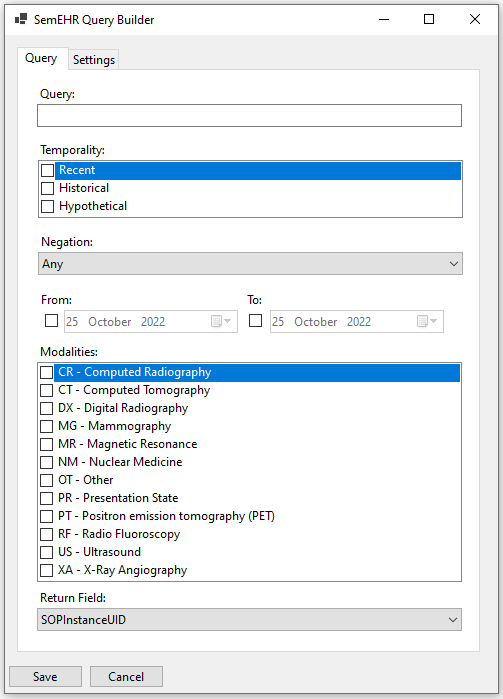
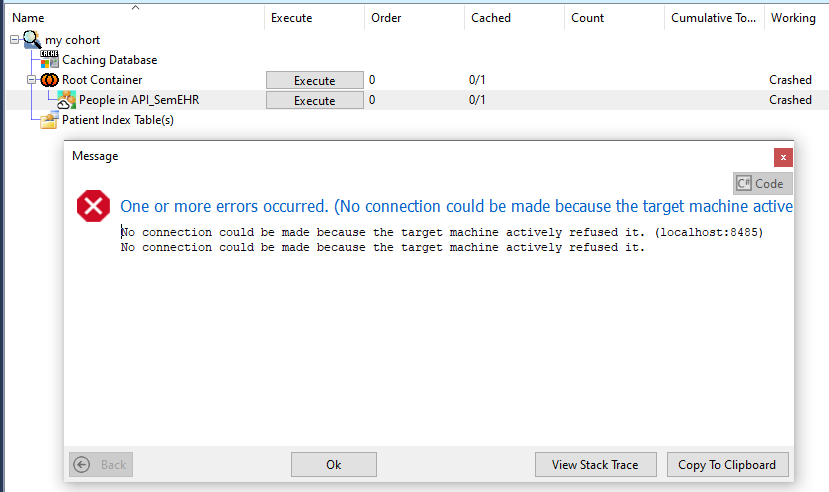

# NLP Cohort Building

1. [Background](#Background)
1. [Loading Data](#loading-data)
1. [Starting the REST API](#starting-the-rest-api)
1. [Adding the API endpoint in RDMP](#adding-the-api-endpoint-in-rdmp)

## Background
Imaging studies are often accompanied by a clinical report of findings.  This is typically
stored in a 'Structured Report' (SR).  The text stored in these reports can be very helpful
for cohort building.  The free text and tree structure of SRs make them difficult to process
into a relational database.  A better approach is to use a dedicated NLP framework and query
it from the Cohort Builder.  One such NLP tool is [SemEHR]

RDMP supports [cohort building plugins](https://github.com/HicServices/RDMP/blob/develop/Documentation/CodeTutorials/CohortBuildingApiPlugins.md#cohort-building-api-plugins).
A plugin has been created to interface with SR data held in a [SemEHR] instance.

## Loading Data
Before you can use the plugin you must first load your data into a SemEHR instance.
 
https://github.com/SMI/SmiServices/tree/master/src/applications/SRAnonTool

## Starting the REST API
The REST API must be configured and accessible over HTTPS.  Test that you are able
to get a response from the API with your web browser

## Adding the API endpoint in RDMP

In RDMP API endpoints are modelled as [Catalogue] objects in the same way as regular relational database datasets.  Create a new one by right clicking any existing [Catalogue] and selecting 'Create New Sem EHR Catalogue':



Alternatively from the command line you can run:

```
./rdmp CreateNewSemEHRCatalogue
```

## Using the API endpoint in Cohort Builder
Create a new [CohortIdentificationConfiguration].  Ensure you have [enabled query caching](https://github.com/HicServices/RDMP/blob/develop/Rdmp.Core/CohortCreation/Readme.md#creating-a-cache).  

Add your new 'Sem EHR Catalogue' to the root container of the configuration



Double click the added cohort set to launch the configuration screen.



Enter a search term, negation (optional), date range (optional) and Modality.

Ensure the Settings are correct and run the query.  If the 'Working' column changes to 'Crashed' then you can double click the row to view the error:



To get back to the settings/query screen after error right click the cohort set and choose 'Edit'


[SemEHR]: https://github.com/CogStack/CogStack-SemEHR
[Catalogue]: https://github.com/HicServices/RDMP/blob/develop/Documentation/CodeTutorials/Glossary.md#catalogue
[CohortIdentificationConfiguration]: https://github.com/HicServices/RDMP/blob/develop/Documentation/CodeTutorials/Glossary.md#cohortidentificationconfiguration