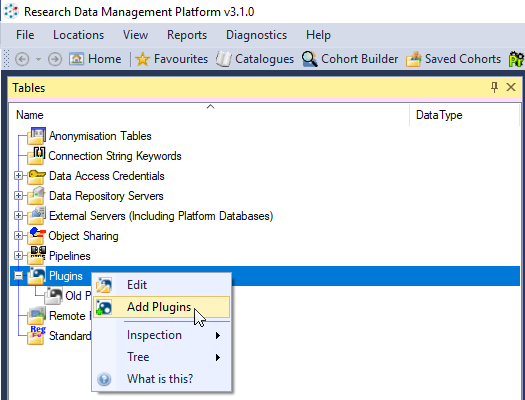

[](https://travis-ci.org/HicServices/RdmpDicom) [](https://lgtm.com/projects/g/HicServices/RdmpDicom/alerts/) [](https://buildstats.info/nuget/HIC.RDMP.Dicom)

# RdmpDicom
Plugin for [RDMP](https://github.com/HicServices/RDMP) that adds support for load, linking (with EHR data in relational databases) and extracting anonymous DICOM images for researchers.


# Using Plugin

The following demo shows how to deploy and use the RDMP dicom plugin:
https://youtu.be/j42hmVZKRb4

Releases of the Rdmp.Dicom plugin are hosted in the [Releases section of this Github Repository](https://github.com/HicServices/RdmpDicom/releases).  Once you have downloaded the plugin you can add it to your RDMP instance through the Plugins node in the Tables collection:



Once installed the following functionality is available:

- [Data Load](./Documentation/DataLoad.md)
- [Data Extraction](./Documentation/DataExtraction.md)
- [Caching (Fetching images from a DicomServer)](./Documentation/Caching.md)

# Building

Building requires MSBuild 15 or later (or Visual Studio 2017 or later).  You will also need to install the [DotNetCore 2.2 SDK](https://dotnet.microsoft.com/download).

You can build Rdmp.Dicom as a plugin for RDMP by running the following (use the Version number in [SharedAssemblyInfo.cs](SharedAssemblyInfo.cs) in place of 0.0.1)

```bash
cd Plugin/windows
dotnet publish --runtime win-x64 -c Release --self-contained false
cd ../main
dotnet publish --runtime win-x64 -c Release --self-contained false
dotnet publish --runtime linux-x64 -c Release --self-contained false
cd ../..
nuget pack ./Rdmp.Dicom.nuspec -Properties Configuration=Release -IncludeReferencedProjects -Symbols -Version 0.0.1
```

This will produce a nupkg file (e.g. Rdmp.Dicom.0.0.1.nupkg) which can be consumed by both the RDMP client and dot net core RDMP CLI.


# New CLI Commands

This plugin adds the following commands to RDMP CLI:

```
./rdmp cmd CFind 2001-01-01 2020-01-01 www.dicomserver.co.uk 104 you me .
```
_Connects to the given PACS and writes CFind response for date range into output file (note that the . denotes current directory)_


```
./rdmp cmd PACSFetch 2001-01-01 2020-01-01 www.dicomserver.co.uk 104 you localhost 104 me . 0
```
_Connects to the given PACS and fetches all images between the date ranges (requires firewall allows incomming connections from destination server)_

