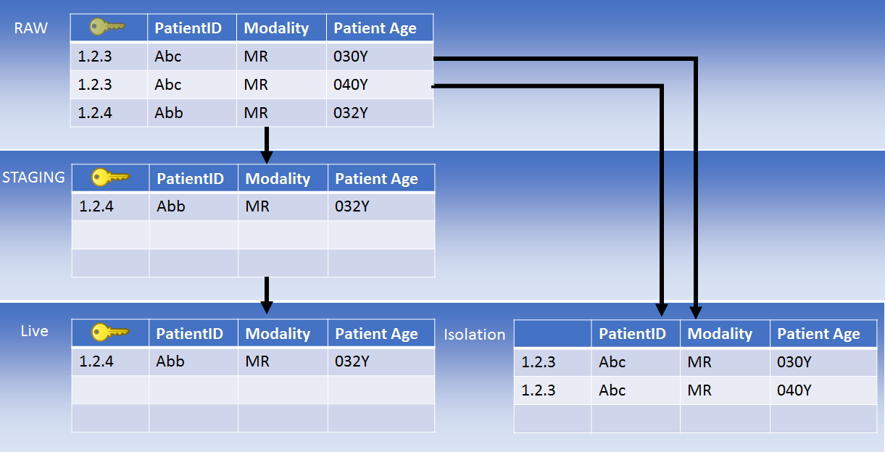
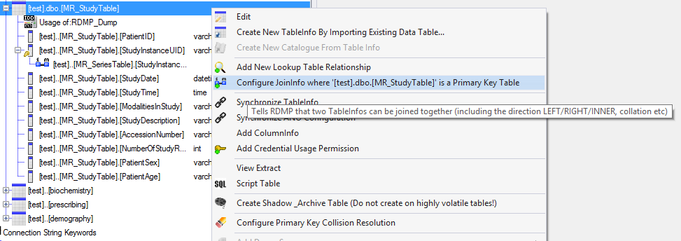

# Primary Key Collision Isolation Mutilation

## Background

In order to load data into a table, RDMP requires that it have a primary key held in the source data (i.e. not an auto increment).  This helps prevent duplication and allows MERGE updates over time.  

'Primary key collision' is when two rows have the same primary key value but differ on another column (RDMP already deals with exact duplication in rows).  

'Primary key collisions' must be resolved in the AdjustRAW (or Mounting) stages of the data load (before the data is migrated to STAGING).  This is possible because the RAW database schema does not have constraints (primary key, not null etc).

There are several modules in Core RDMP for achieving this goal:

| Module | Role |
| ------------- | ------------- |
| SafePrimaryKeyCollisionResolverMutilation  | When you know duplication is introduced by a single column (e.g. file path), this component lets you specify a rule e.g. 'prefer nulls' / 'prefer larger values'|
| Coalescer  | When duplication can be resolved by overwriting null cells with values from colliding rows (e.g. if Modality is null in one image and populated in another that shares the same StudyInstanceUID)|
| SQL Scripts  | Arbitrary SQL can be written to run in AdjustRAW for corner cases|

The 'Primary Key Collision Isolation Mutilation' component exists as an alternative to resolving primary key collisions.  Instead it moves the colliding records (and any child/parent records) into a seperate table for later processing.

It is intended to be used when datasets are wide (have lots of columns) and collisions are rare (e.g. 1 record per million results in a collision).

## Mechanics

'Primary Key Collision Isolation Mutilation' should be added after all other attempts to resolve duplication have run (e.g. `Coalescer`).  You should also add a `Distincter` to any tables you expect to have identical record duplication in them (e.g. Study / Series tables).

The component will undertake the following steps:

1. Identify a colliding primary key value
2. Copy rows to Isolation database
3. Delete rows in RAW



## Multi Table Mode

When there are multiple tables being loaded at once (e.g. Study, Series, Image) then additional steps are required:

1. Identify a colliding primary key value (e.g. SeriesInstanceUID)
2. Identify the parent table primary key value (e.g. StudyInstanceUID)
3. Identify all records in all tables that belong to the parent key (e.g. StudyInstanceUID)
4. Copy rows to Isolation database
3. Delete rows in RAW

It is important to note that this behaviour will migrate the full study even if the key collision exists only at the Series/Image level (to prevent incomplete data entering LIVE).

In order to support multi table mode you must create JoinInfo objects that tells RDMP how to join the tables:



**You will also have to set the parent table (Study) as** `IsPrimaryExtractionTable` **(double click the table to set this).**

The component checks will tell you if it is unable to resolve a valid set of joins between the tables selected.  

## Implementation

Collisions are detected by using a GROUP BY on the primary key:
```sql
SELECT MyKey 
FROM  MyTable
GROUP BY MyKey
HAVING count(*)>1
```

For this reason it is important to remove identical duplication before running the component.

If the collision is not in the primary table (e.g. Study) then the primary key is looked up.

```sql
SELECT StudyInstanceUID
FROM Study 
LEFT JOIN Series ON Study.StudyInstanceUID = Series.StudyInstanceUID
LEFT JOIN Image ON Series.SeriesInstanceUID = Image.SeriesInstanceUID
WHERE
Series.SeriesInstanceUID = '1.2.3'
```

Records are then migrated to the isolation tables for the primary key value (In this example the series '1.2.3' exists in the study '9.9.9')

```sql
SELECT Study.*
FROM Study 
LEFT JOIN Series ON Study.StudyInstanceUID = Series.StudyInstanceUID
LEFT JOIN Image ON Series.SeriesInstanceUID = Image.SeriesInstanceUID
WHERE
Study.StudyInstanceUID = '9.9.9'

SELECT Series.*
FROM Study 
LEFT JOIN Series ON Study.StudyInstanceUID = Series.StudyInstanceUID
LEFT JOIN Image ON Series.SeriesInstanceUID = Image.SeriesInstanceUID
WHERE
Study.StudyInstanceUID = '9.9.9'

SELECT Image.*
FROM Study 
LEFT JOIN Series ON Study.StudyInstanceUID = Series.StudyInstanceUID
LEFT JOIN Image ON Series.SeriesInstanceUID = Image.SeriesInstanceUID
WHERE
Study.StudyInstanceUID = '9.9.9'
```

Rows are then deleted from the RAW tables for the given primary key value in reverse order - grand child => child => parent.

```sql
DELETE Image
FROM Study 
LEFT JOIN Series ON Study.StudyInstanceUID = Series.StudyInstanceUID
LEFT JOIN Image ON Series.SeriesInstanceUID = Image.SeriesInstanceUID
WHERE
Study.StudyInstanceUID = '9.9.9'

DELETE Series
FROM Study 
LEFT JOIN Series ON Study.StudyInstanceUID = Series.StudyInstanceUID
LEFT JOIN Image ON Series.SeriesInstanceUID = Image.SeriesInstanceUID
WHERE
Study.StudyInstanceUID = '9.9.9'

DELETE Study
FROM Study 
LEFT JOIN Series ON Study.StudyInstanceUID = Series.StudyInstanceUID
LEFT JOIN Image ON Series.SeriesInstanceUID = Image.SeriesInstanceUID
WHERE
Study.StudyInstanceUID = '9.9.9'

```

## Tests

Unit tests for the component can be found in [PrimaryKeyCollisionIsolationMutilationTests.cs](../../SMIPluginTests/Unit/PrimaryKeyCollisionIsolationMutilationTests.cs)

The full stack test (in which dicom images containing duplication at study level are created) is [IntegrationTest_HappyPath_WithIsolation](../../Microservices/Tests/Microservices.Tests.RDMPTests/MicroservicesIntegrationTest.cs)

